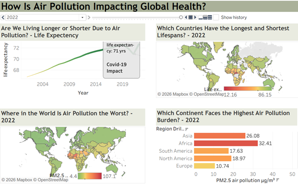
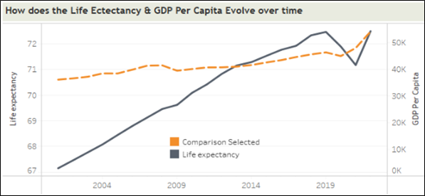
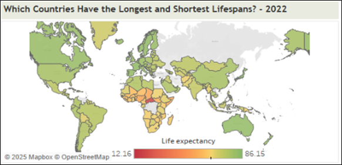
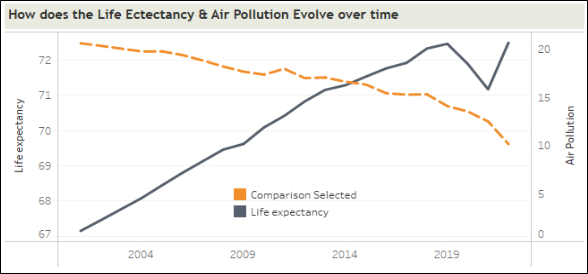

# 🌍 Air Pollution & Life Expectancy Analysis

### 📊 Data Visualization & Analytics Project | Tableau | Public Health | Global Data


---

# Project Overview

This project analyzes how **air pollution, economic conditions, and healthcare spending influence life expectancy across countries**.

Using **Tableau**, an interactive dashboard was developed to explore global trends and relationships between:

- PM2.5 air pollution  
- Life expectancy  
- GDP per capita  
- Public health expenditure  

The project integrates multiple international datasets to identify **global patterns in environmental and economic factors affecting human longevity**.

---

# 🌐 Interactive Tableau Dashboard

👉 **Explore the full interactive dashboard**

[Open Tableau Dashboard](https://public.tableau.com/app/profile/sucharitha.reddy.gaddam/viz/HealthCostofAirPollution/HowIsAirPollutionImpactingGlobalHealth)

The dashboard allows users to:

- Explore **global pollution levels**
- Analyze **life expectancy trends**
- Compare **economic indicators and health outcomes**
- Interact with **multiple visualizations and filters**

---
## Dashboard Preview

[](https://public.tableau.com/app/profile/sucharitha.reddy.gaddam/viz/HealthCostofAirPollution/HowIsAirPollutionImpactingGlobalHealth)

---

# 📊 Dashboard Highlights

These visualizations highlight key relationships between **air pollution, economic development, and global health outcomes**.

### 1️⃣ Life Expectancy vs GDP Per Capita Over Time

This visualization shows the relationship between economic development and life expectancy over time.



---

### 2️⃣ Global Life Expectancy Distribution

This world map highlights countries with the **highest and lowest life expectancy**, revealing regional disparities in health outcomes.



---

### 3️⃣ Life Expectancy vs Air Pollution Over Time

This chart demonstrates the relationship between **PM2.5 air pollution levels and life expectancy**, showing how environmental quality influences public health.



---

# Research Questions

What factors most strongly influence life expectancy across countries?

Specifically:

- Does **air pollution reduce life expectancy?**
- Do **wealthier countries live longer?**
- Does **healthcare spending significantly improve longevity?**

---

# Data Sources

| Source | Dataset |
|------|------|
| World Health Organization | Life expectancy |
| World Bank | PM2.5 air pollution |
| Our World in Data | Public health expenditure |
| International Monetary Fund | GDP per capita |

---

# Data Processing Workflow

1. Data collected from multiple global repositories  
2. Cleaning and normalization of datasets  
3. Dataset integration using **Country and Year**  
4. Exploratory data analysis  
5. Visualization development in **Tableau**  
6. Correlation and trend analysis  

---

# Dashboard Features

The Tableau dashboard includes:

- Global **life expectancy trends over time**
- **Air pollution heatmaps by country**
- **Regional comparisons of pollution levels**
- **GDP vs Life Expectancy correlation analysis**
- **Healthcare spending vs longevity analysis**
- **Time-series analysis of global health indicators**

---

# Key Insights

### 1️⃣ Life expectancy is increasing globally

Between **2001 and 2022**, global life expectancy increased significantly, indicating improvements in healthcare and living conditions.

### 2️⃣ Air pollution is strongly linked to longevity

Countries with **higher PM2.5 pollution levels generally exhibit lower life expectancy**, suggesting environmental quality is a key public health factor.

### 3️⃣ Wealthier countries live longer

Higher **GDP per capita correlates with longer life expectancy**, likely due to better healthcare infrastructure and living standards.

### 4️⃣ Healthcare spending shows moderate impact

Countries investing more in **public health expenditure tend to have better life expectancy outcomes**, although economic and environmental factors also play major roles.

---

# Technologies Used

- **Tableau** — Dashboard development  
- **CSV datasets** — Global health and economic indicators  
- **Exploratory Data Analysis**  
- **Geospatial Visualization**  
- **Time-series Analysis**

---

# Repository Structure

```
air-pollution-life-expectancy-analysis
│
├── README.md
├── Health Cost of Air Pollution.twbx
├── dashboard_preview.png
├── Air pollution & Life Expectancy.pdf
│
├── trend-gdp-life-expectancy.png
├── life-expectancy-map.png
├── life-expectancy-air-pollution.png
│
└── data
    ├── life-expectancy.csv
    ├── pm25-air-pollution.csv
    ├── public-health-expenditure-share-gdp.csv
    └── Ecomonic Indicator Income data.csv
```

---

# How to Explore the Dashboard

1. Install **Tableau Desktop** or **Tableau Public**  
2. Download the `.twbx` file  
3. Open the workbook  
4. Interact with filters and visualizations to explore relationships between pollution, economics, and life expectancy

Or explore the **live version directly**:

[View Interactive Dashboard](https://public.tableau.com/app/profile/sucharitha.reddy.gaddam/viz/HealthCostofAirPollution/HowIsAirPollutionImpactingGlobalHealth)

---

# Skills Demonstrated

- Data Visualization  
- Exploratory Data Analysis  
- Data Integration  
- Public Health Analytics  
- Tableau Dashboard Design  
- Data Storytelling  
